# 🌱 Smart Farm Soil Monitoring System

## Real-Time Multi-Node Soil Health Monitoring, AI Analysis & Farm Recommendations

The **Smart Farm Soil Monitoring System** is an IoT + AI agricultural monitoring platform that monitors soil and environmental conditions at multiple locations in a farm.

It uses **ESP32 sensor nodes**, an **ESP32 gateway**, **ESP-NOW**, **Wi-Fi**, **ThingsBoard Cloud**, a **FastAPI backend**, and a **Random Forest ML model**.

### Monitored parameters

- Soil moisture
- Soil pH
- Electrical Conductivity (EC)
- Nitrogen (N)
- Phosphorus (P)
- Potassium (K)
- Soil temperature
- Air temperature
- Air humidity

The complete pipeline is:

**Sensors → ESP32 Nodes → ESP-NOW → ESP32 Gateway → Wi-Fi → ThingsBoard → FastAPI → AI/Decision Engine → Dashboard**

---

## 📌 Table of Contents

- [Problem Statement](#-problem-statement)
- [Objectives](#-objectives)
- [What the Project Does](#-what-the-project-does)
- [System Architecture](#-system-architecture)
- [Hardware Architecture](#-hardware-architecture)
- [Communication Architecture](#-communication-architecture)
- [Data Flow](#-data-flow)
- [AI/ML Pipeline](#-aiml-pipeline)
- [AI Decision and Recommendation](#-ai-decision-and-recommendation)
- [ThingsBoard Architecture](#-thingsboard-architecture)
- [Backend Architecture](#-backend-architecture)
- [Dashboard Architecture](#-dashboard-architecture)
- [Alert Generation](#-alert-generation)
- [Historical AI Analysis](#-historical-ai-analysis)
- [Node Comparison](#-node-comparison)
- [Demo Scenario](#-demo-scenario)
- [Development Phases](#-development-phases)
- [Technology Stack](#-technology-stack)
- [Project Structure](#-project-structure)
- [How to Run](#-how-to-run)
- [API Endpoints](#-api-endpoints)
- [Future Scope](#-future-scope)
- [Important Notes](#-important-notes)

---

## 🎯 Problem Statement

Soil conditions can vary considerably between different locations in the same farm. Manual measurement is periodic and makes it difficult to continuously monitor these variations.

This project provides a multi-node system that:

1. Collects soil and environmental data automatically.
2. Transmits readings wirelessly.
3. Sends telemetry to an IoT cloud.
4. Retrieves live telemetry through a backend.
5. Uses ML for soil-health classification.
6. Generates confidence scores.
7. Detects abnormal conditions.
8. Generates recommendations and alerts.
9. Maintains AI history.
10. Compares different farm locations.

---

## 🎯 Objectives

- Build a multi-node ESP32 monitoring system.
- Use ESP-NOW for node-to-gateway communication.
- Use Wi-Fi for cloud connectivity.
- Integrate ThingsBoard.
- Develop a FastAPI backend.
- Integrate a Random Forest model.
- Generate AI confidence where supported.
- Generate recommendations and alerts.
- Compare Node 1 and Node 2.
- Maintain historical AI analysis.
- Provide a real-time dashboard.

---

## 🔍 What the Project Does

Each node collects the following values:

| Parameter | Unit |
|---|---|
| Soil Moisture | % |
| Air Temperature | °C |
| Air Humidity | % |
| Soil Temperature | °C |
| Soil pH | pH |
| EC | dS/m |
| Nitrogen | mg/kg |
| Phosphorus | mg/kg |
| Potassium | mg/kg |

The gateway receives node data using ESP-NOW and forwards telemetry to ThingsBoard using Wi-Fi.

The FastAPI backend retrieves telemetry, normalizes it, sends the nine features to the Random Forest model, and combines the AI result with condition checks to produce useful recommendations.

The dashboard displays live readings, AI prediction, confidence, soil score, alerts, recommendations, NPK comparison, farm comparison and AI history.

---

## 🏗️ System Architecture

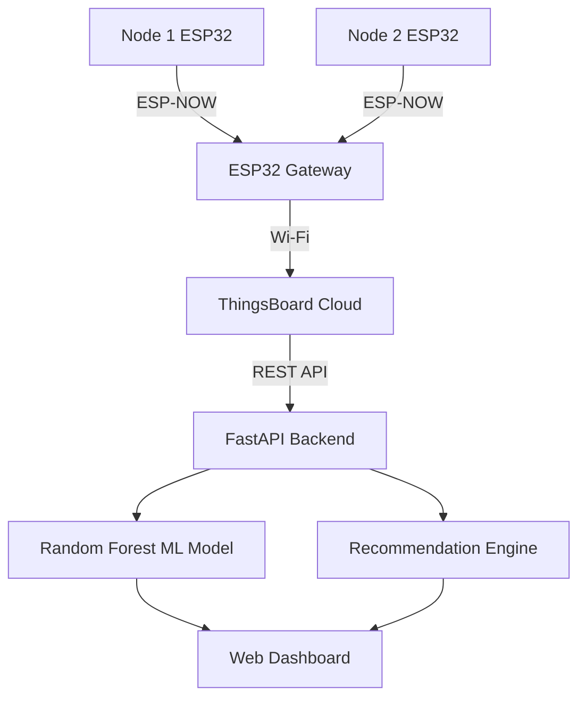

---

## 🔌 Hardware Architecture

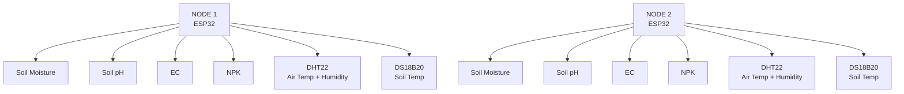

---

## 📡 Communication Architecture

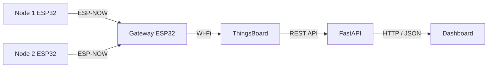

| Layer | Technology | Purpose |
|---|---|---|
| Node → Gateway | ESP-NOW | Local wireless communication |
| Gateway → Cloud | Wi-Fi | Internet connectivity |
| ThingsBoard → Backend | REST API | Telemetry retrieval |
| Backend → Dashboard | HTTP/JSON | Application data |

---

## 🔄 Data Flow

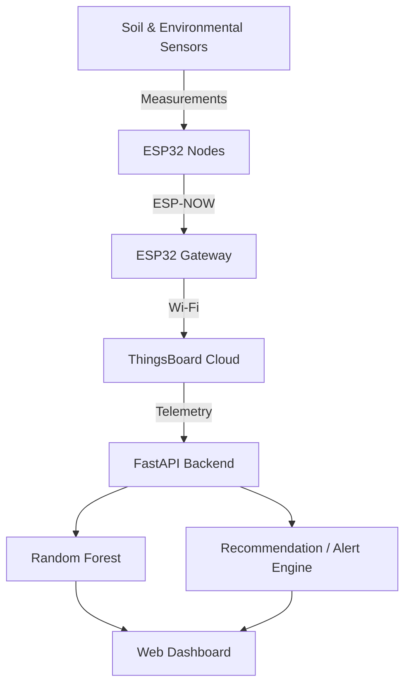

---

## 🤖 AI/ML Pipeline

The model uses these features in this exact order:

```text
moisture
pH
EC
nitrogen
phosphorus
potassium
soilTemperature
airTemperature
airHumidity
```

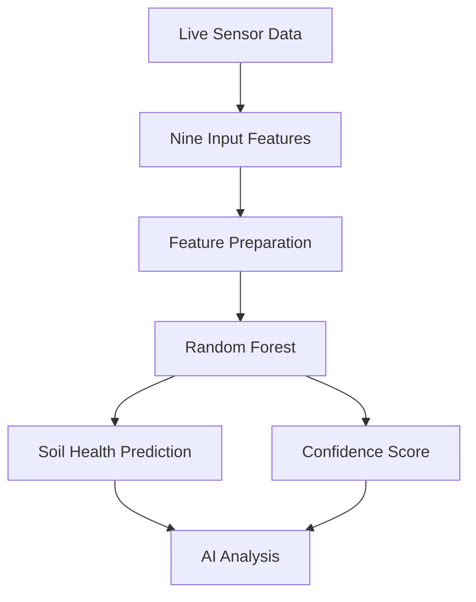

---

## 🧠 AI Decision and Recommendation

The ML model classifies soil health; the condition/recommendation layer checks field parameters and produces actionable guidance.

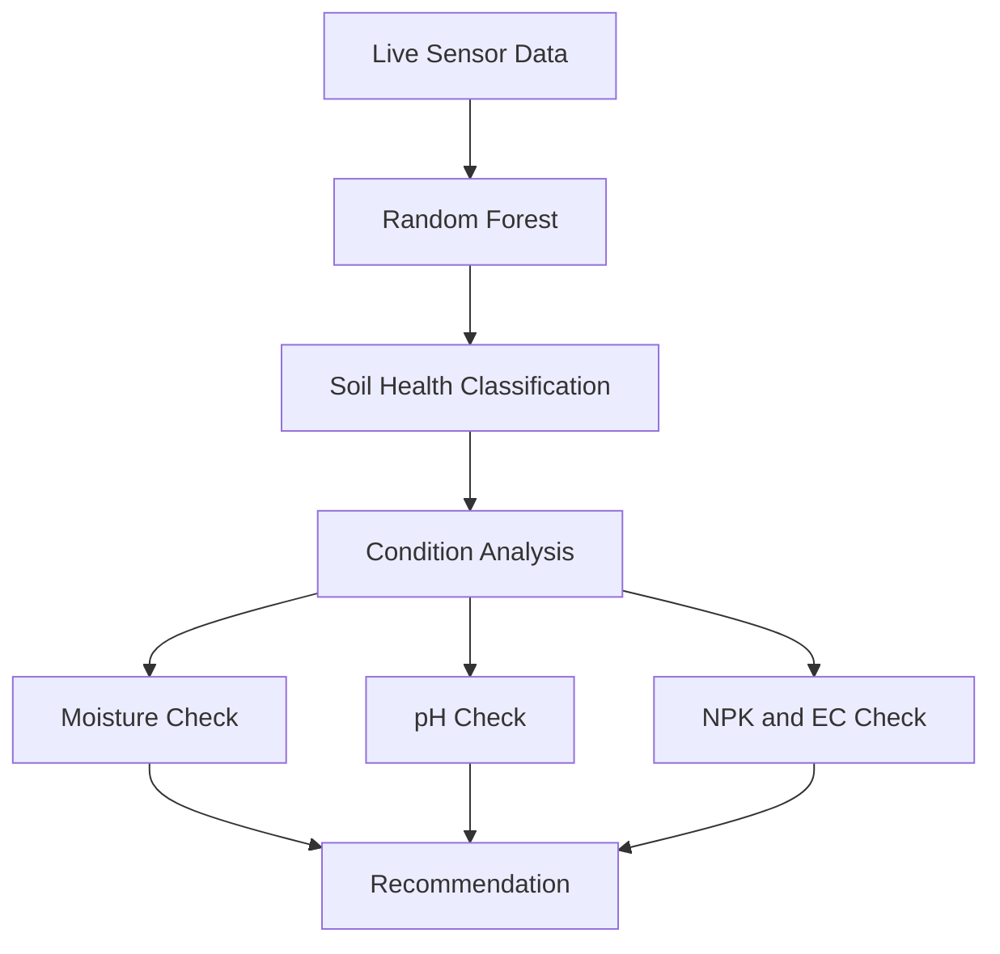

Example:

```text
Moisture = 0%
    ↓
Below target range
    ↓
HIGH priority
    ↓
Irrigation recommended
```

---

## ☁️ ThingsBoard Architecture

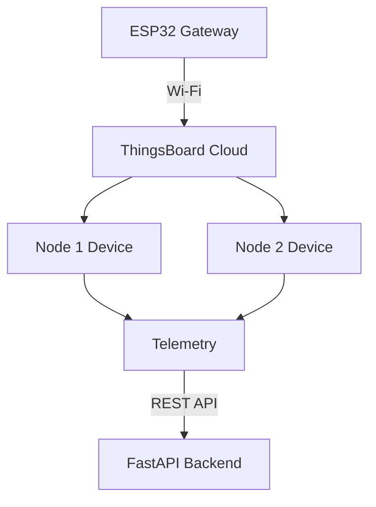

Expected telemetry keys:

```text
moisture
airTemperature
airHumidity
soilTemperature
pH
EC
nitrogen
phosphorus
potassium
```

---

## ⚙️ Backend Architecture

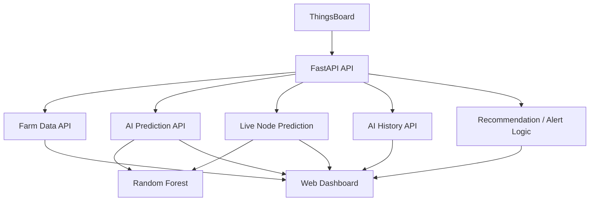

---

## 🖥️ Dashboard Architecture

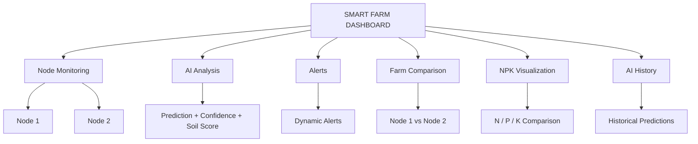

---

## 🚨 Alert Generation

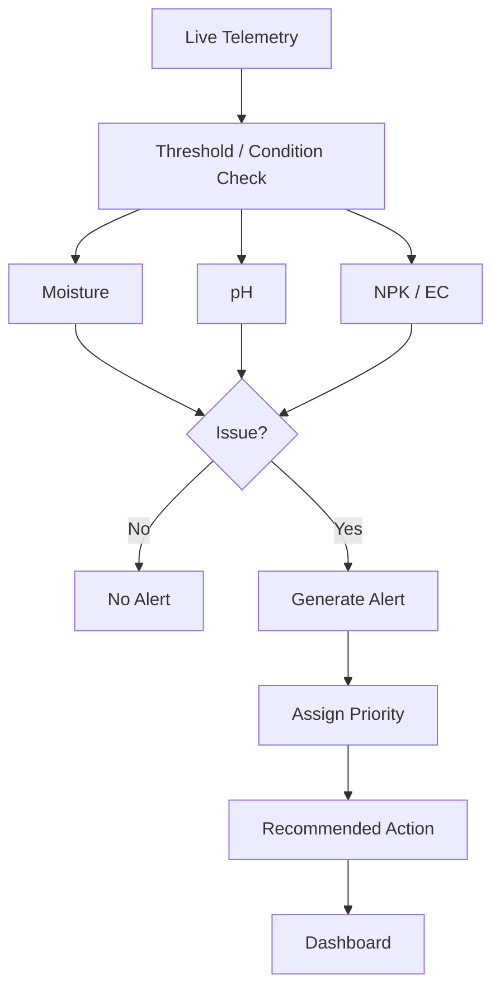

---

## 🕒 Historical AI Analysis

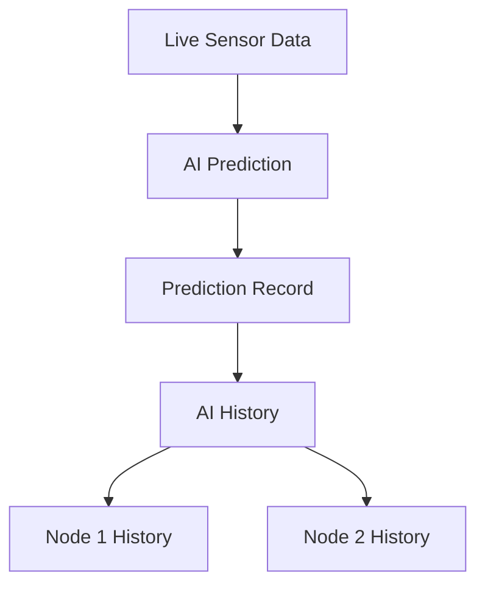

A history record contains information such as:

- Timestamp
- Node
- Prediction
- Confidence
- Priority
- Action
- Reason
- Issue count

Endpoints:

```text
GET /api/ai/history/1
GET /api/ai/history/2
```

---

## 📊 Node Comparison

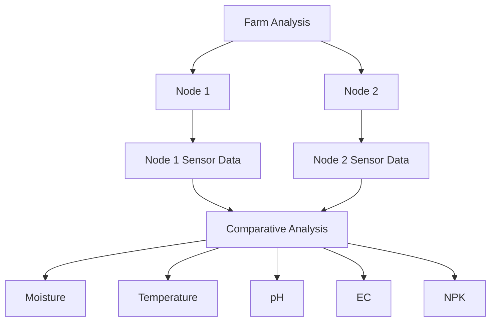

The comparison allows the system to identify that different areas of the same farm may require different actions.

---

## 🎬 Demo Scenario

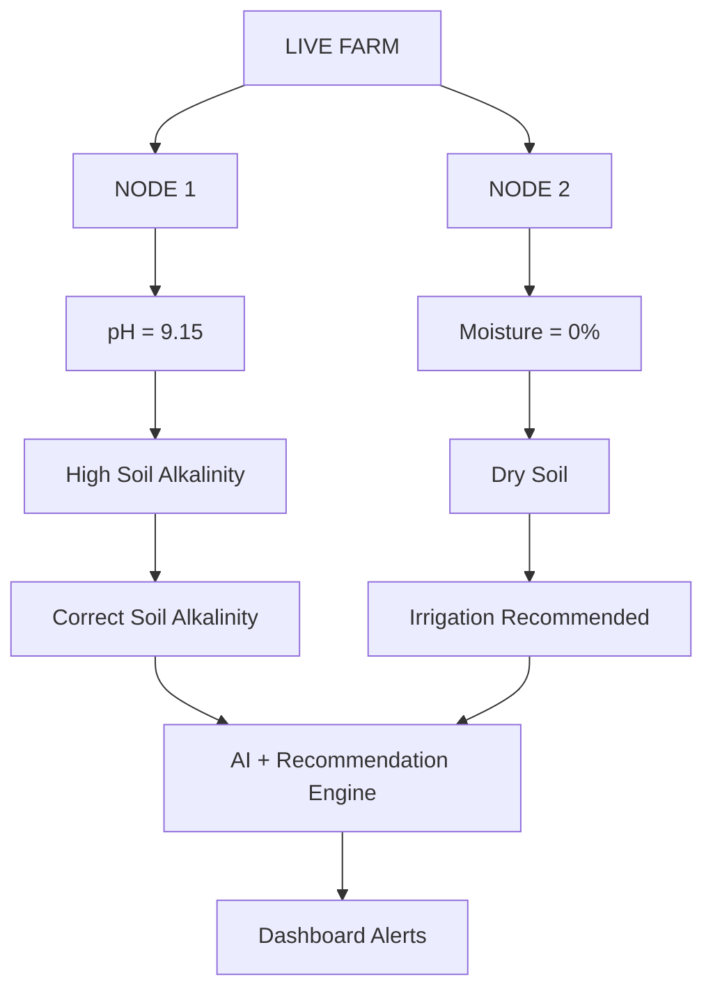

Example demonstrated outputs:

**Node 1**

```text
pH = 9.15
AI Prediction = Healthy
Confidence = 71.5%
Priority = HIGH
Recommendation = Correct soil alkalinity
```

**Node 2**

```text
Moisture = 0.0%
AI Prediction = Healthy
Confidence = 73.5%
Priority = HIGH
Recommendation = Irrigation recommended
```

---

## 🛠️ Development Phases

### Phase 1 — Project Definition

The project was defined as a multi-location farm monitoring system for soil and environmental conditions.

### Phase 2 — Sensor Nodes

ESP32-based Node 1 and Node 2 were assembled and connected to soil/environmental sensors.

### Phase 3 — Gateway

A third ESP32 was introduced as the gateway for the field nodes.

### Phase 4 — ESP-NOW

ESP-NOW was implemented for wireless Node → Gateway communication.

### Phase 5 — ThingsBoard

ThingsBoard Cloud was introduced for device telemetry and cloud communication.

### Phase 6 — FastAPI

A FastAPI backend was developed to retrieve ThingsBoard telemetry and expose application APIs.

### Phase 7 — Machine Learning

The Random Forest model was integrated using:

```text
models/soil_health_model.pkl
```

The backend prepares the nine required features and obtains the prediction and confidence.

### Phase 8 — Recommendation and Alerts

Condition-specific recommendations and dynamic alerts were added.

### Phase 9 — Dashboard

A web dashboard was developed for live readings, AI analysis, recommendations and comparison.

### Phase 10 — AI History

Historical prediction records were added for each node.

### Phase 11 — Multi-Node Comparison

Node 1 and Node 2 were integrated into the same dashboard for field-zone comparison.

### Phase 12 — End-to-End Testing

The final pipeline was verified from:

```text
Sensor
 → ESP32 Node
 → ESP-NOW
 → Gateway
 → Wi-Fi
 → ThingsBoard
 → FastAPI
 → Random Forest + Decision Engine
 → Dashboard
```

---

## 🧰 Technology Stack

### Hardware

- ESP32 × 3
- Soil moisture sensor
- Soil pH sensor
- EC sensor
- NPK sensor
- DHT22
- DS18B20
- Breadboard and jumper wires

### Software

- Arduino IDE
- Python
- FastAPI
- Uvicorn
- Requests
- Pydantic
- python-dotenv
- Joblib
- Scikit-learn

### IoT / Cloud

- ESP-NOW
- Wi-Fi
- ThingsBoard Cloud

### AI

- Random Forest
- Joblib model serialization

### Frontend

- HTML
- CSS
- JavaScript

---

## 📁 Project Structure

A typical repository layout is:

```text
Smart-Farm-Soil-Monitoring/
│
├── backend/
│   ├── app/
│   │   └── ...
│   ├── models/
│   │   └── soil_health_model.pkl
│   ├── .env
│   ├── requirements.txt
│   └── ...
│
├── frontend/
│   ├── index.html
│   ├── style.css
│   ├── script.js
│   └── ...
│
├── esp32/
│   ├── node1/
│   ├── node2/
│   └── gateway/
│
└── README.md
```

> Update this tree if the final repository uses different filenames/directories.

---

## 🚀 How to Run

### 1. Clone

```bash
git clone <YOUR_REPOSITORY_URL>
cd <YOUR_REPOSITORY_DIRECTORY>
```

### 2. Create a virtual environment

Windows PowerShell:

```powershell
python -m venv venv
.env\Scripts\Activate.ps1
```

Linux/macOS:

```bash
python3 -m venv venv
source venv/bin/activate
```

### 3. Install dependencies

```bash
pip install -r requirements.txt
```

### 4. Configure environment variables

Create `backend/.env`:

```env
THINGSBOARD_URL=https://thingsboard.cloud
THINGSBOARD_API_KEY=YOUR_THINGSBOARD_API_KEY
NODE1_DEVICE_ID=YOUR_NODE1_DEVICE_ID
NODE2_DEVICE_ID=YOUR_NODE2_DEVICE_ID
```

Never commit real credentials.

### 5. Check the ML model

Ensure:

```text
backend/models/soil_health_model.pkl
```

exists.

### 6. Configure and upload ESP32 firmware

Open the Node 1, Node 2 and Gateway sketches in Arduino IDE.

Configure the appropriate:

- ESP32 board
- COM port
- Sensor pins
- Wi-Fi credentials
- Gateway MAC address
- ThingsBoard credentials where required

Upload to all three ESP32 boards.

### 7. Start FastAPI

From the backend directory:

```bash
uvicorn app.main:app --reload
```

Backend:

```text
http://127.0.0.1:8000
```

Swagger:

```text
http://127.0.0.1:8000/docs
```

### 8. Test the API

```text
GET /api/health
GET /api/farm-data
GET /api/ai/predict/1
GET /api/ai/predict/2
GET /api/ai/history/1
GET /api/ai/history/2
```

### 9. Start the frontend

For a static frontend, a simple local server can be used:

```bash
python -m http.server 5500
```

Then open:

```text
http://127.0.0.1:5500
```

Make sure the frontend API base URL points to:

```text
http://127.0.0.1:8000
```

---

## 🔗 API Endpoints

| Method | Endpoint | Purpose |
|---|---|---|
| GET | `/` | API status |
| GET | `/api/health` | Backend/model health |
| GET | `/api/farm-data` | Live Node 1 + Node 2 data |
| POST | `/api/ai/predict` | Predict from supplied values |
| GET | `/api/ai/predict/{node_id}` | Predict from live node |
| GET | `/api/ai/history/{node_id}` | AI prediction history |

Example manual prediction:

```json
{
  "moisture": 61,
  "pH": 6.8,
  "EC": 1.35,
  "nitrogen": 48,
  "phosphorus": 32,
  "potassium": 41,
  "soilTemperature": 23.8,
  "airTemperature": 25.1,
  "airHumidity": 87.4
}
```

---

## 🚀 Future Scope

- More ESP32 sensor nodes
- Automated irrigation using relay/pump control
- Crop-specific recommendations
- Fertilizer optimization
- Yield prediction
- Time-series soil analysis
- Seasonal trend analysis
- Mobile application
- Improved ML models such as XGBoost or neural networks
- Long-term farm-zone analytics

---

## ⚠️ Important Notes

### Sensor Calibration

For real agricultural deployment, sensors should be properly calibrated. Soil pH, EC, moisture and NPK readings depend on sensor type, soil characteristics and calibration.

### ML Model Limitations

Model performance depends on the quality and representativeness of its training dataset. A production deployment should include diverse soil types, crops, environmental conditions and geographically representative data.

### Security

Never commit:

```text
.env
Wi-Fi passwords
ThingsBoard API keys
private device credentials
```

Use environment variables or a proper secret-management solution.

---

## 🌱 Project Summary

The Smart Farm Soil Monitoring System combines **IoT sensing, wireless communication, cloud telemetry, backend APIs, machine learning, rule-based analysis and visualization** into a single agricultural monitoring platform.

Its key workflow is:

> **Monitor → Analyze → Recommend**

Instead of only displaying raw sensor readings, the system attempts to turn those readings into location-specific information that can help a farmer identify soil conditions requiring attention.

---

## 👥 Project

**Smart Farm Soil Monitoring System**

**Real-Time Multi-Node Soil Health Monitoring**

**Monitor → Analyze → Recommend**
